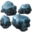
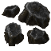
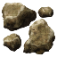

# TRAIN COLORS

## Iron Ore (0, 140, 255)

## Copper Ore (255, 55, 0)

## Coal (0, 0, 0)

## Stone (150, 100, 80)

## Uranium Ore (100, 180, 0)

## Iron Plates (210, 210, 255)

## Copper Plates (255, 125, 85)

## Steel (200, 200, 200)

## Gears (150, 150, 150)

## Uranium (40, 100, 50)

## Green Circuits (0, 255, 0)

## Red Ciruits (255, 0, 0)

## Blue Circuits (0, 0, 255)

## Oil (0, 0, 30)

## Lubricant (0, 170, 0)

## Acid (255, 255, 0)

## Plastic (255, 255, 255)

## Explosives (165, 60, 15)

## Red Science (255, 50, 50)

## Green Science (100, 255, 100)

## Blue Science (80, 180, 255)

## Grey Science (200, 200, 255)

## Purple Science (255, 80, 255)

## Yellow Science (255, 180, 80)

## Space Science (200, 200, 255)

## Solar (0, 100, 150)

## Rocket Supply (255, 0, 100)

## PAX Shuttle (255, 0, 255)
